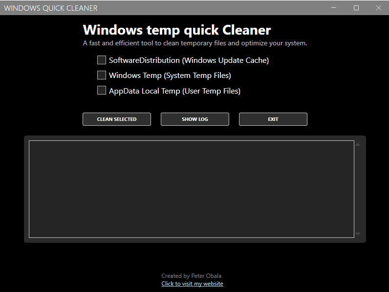

# 🧼 Windows Quick Cleaner

A fast and efficient desktop tool to clean temporary files and optimize your Windows system.  
Built with C# and WPF (MahApps.Metro UI).

## 🔽 Download

You can download the prebuilt executable below:

- [Download SafeCleaner.exe (Mega.nz)](https://mega.nz/file/KBsW1D5C#gtJn7Okl5_KHOSgM8LJtL7Yln5fE8RGqP9hzGhZ6Utk)
> Note: GitHub does not support uploading `.exe` files larger than 100 MB.

## ✨ Features

- Clean Windows Update cache (`SoftwareDistribution`)
- Clean system temporary files (`C:\Windows\Temp`)
- Clean user temporary files (`AppData\Local\Temp`)
- Intuitive and clean dark UI
- ProgressRing animation
- Logging supported (text file)

## 💻 How to use

1. Run `SafeCleaner.exe` **as administrator**
2. Select the locations to clean
3. Click **Clean Selected**
4. View logs with **Show Log**

> No installation needed. Just run the `.exe`.

---

## 🇸🇰 Windows Quick Cleaner – Slovenský popis

Rýchly a efektívny nástroj na čistenie dočasných súborov vo Windows.  
Program je vytvorený v jazyku **C# (WPF)** a má moderné používateľské rozhranie.

### Funkcie:

- Vymazanie cache po aktualizáciách Windows (adresár `SoftwareDistribution`)
- Vyčistenie systémových a používateľských dočasných súborov
- Animovaný ukazovateľ priebehu
- Podpora logovania
- Žiadna inštalácia – len spustíš `.exe` súbor

---

### 👤 Author

**Created by Peter Obala**  
🔗 [https://peterfromslovakia.github.io](https://peterfromslovakia.github.io)

---

