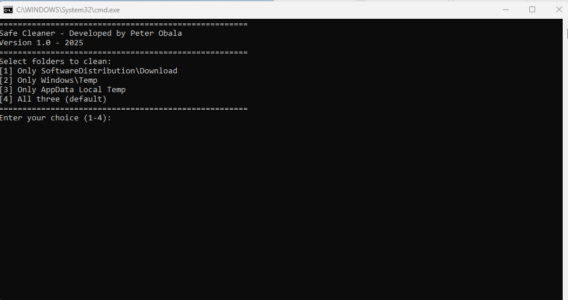

# 🧼 Windows Quick Cleaner

A fast and efficient desktop tool to clean temporary files and optimize your Windows system.  
Built with C# and WPF (MahApps.Metro UI).

## 🔽 Download

You can download the prebuilt executables below:

- [Download SafeCleaner.exe (Mega.nz)](https://mega.nz/file/KBsW1D5C#gtJn7Okl5_KHOSgM8LJtL7Yln5fE8RGqP9hzGhZ6Utk) – full GUI version  
- [`clean_update.bat`](clean_update.bat) – CMD script (lightweight alternative)

> 📌 Note: GitHub does not support uploading `.exe` files larger than 100 MB.  
> 💡 Both versions can be launched directly from USB – no installation needed.

---

## ✨ Features

- Clean Windows Update cache (`SoftwareDistribution`)
- Clean system temporary files (`C:\Windows\Temp`)
- Clean user temporary files (`AppData\Local\Temp`)
- Graphical version with intuitive dark UI
- CMD script version for quick cleanup or tech users
- ProgressRing animation (GUI version)
- Logging supported (log.txt)

---

## 🖱️ How to use (GUI version)

1. Run `SafeCleaner.exe` **as administrator** (Right-click → Run as admin)  
2. Select the locations to clean using the checkboxes  
3. Click **Clean Selected**  
4. View logs with **Show Log**  
5. Optional: Copy the .exe to a USB key and launch from any Windows 10/11 PC

---

## 🔧 CMD version – no GUI needed

For advanced users or quick use from USB stick:

- Use the [`clean_update.bat`](clean_update.bat) script  
- Cleans the same temp locations as the GUI  
- No UI, just a fast and silent cleanup  
- Run as administrator (Right-click → Run as admin)  
- Auto-closes after completion

---

## 🇸🇰 Windows Quick Cleaner – Slovenský popis

Rýchly a efektívny nástroj na čistenie dočasných súborov vo Windows.  
Program je vytvorený v jazyku **C# (WPF)** a má moderné používateľské rozhranie.

### Funkcie:

- Vymazanie cache po aktualizáciách Windows (adresár `SoftwareDistribution`)  
- Vyčistenie systémových a používateľských dočasných súborov  
- Verzia s GUI aj alternatíva vo forme `.bat` skriptu  
- Animovaný ukazovateľ priebehu  
- Podpora logovania (`log.txt`)  
- Žiadna inštalácia – len spustíš `.exe` alebo `.bat`

---

### 👤 Author

**Created by Peter Obala**  
🔗 [https://peterfromslovakia.github.io](https://peterfromslovakia.github.io)
